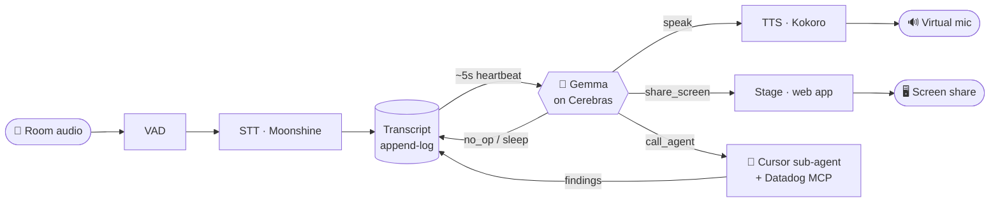
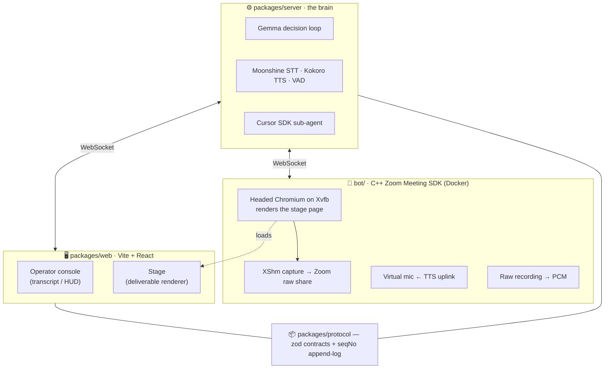

<div align="center">

# 🪐 Atlas — Cerebras Meeting Agent

**A real-time AI participant that joins your meeting, listens, and helps — by voice and on the shared screen.**

Atlas sits in a live conversation, follows along through on-device speech-to-text, and decides — every few seconds — whether it can add value. When it can, it speaks up, puts a diagram on the shared screen, or hands a deep-research task to a sub-agent. When it can't, it stays quiet.

[](https://www.typescriptlang.org/)
[](https://nodejs.org/)
[](https://pnpm.io/)
[](https://cerebras.ai/)
[](https://developers.zoom.us/docs/meeting-sdk/linux/)
[](https://www.docker.com/)

</div>

---

## What it does

- **🎧 Listens in real time** — on-device VAD + speech-to-text turn the room's audio into a live transcript, with zero hosted-STT round-trips.
- **🧠 Decides when to help** — every ~5s heartbeat, a fast Cerebras-hosted Gemma model reads the latest transcript and picks one action: *speak*, *put something on screen*, *dispatch a research agent*, or *stay silent* (the default).
- **🗣️ Responds by voice** — on-device TTS speaks back through a virtual microphone, so the room just hears Atlas talk.
- **🖥️ Thinks visually** — Atlas authors mermaid diagrams and slides onto the shared screen, evolving them as the conversation moves.
- **🔬 Researches out of band** — sharply-scoped investigations are handed to a Cursor-SDK sub-agent (with Datadog + repo MCP access) that works in the background and streams findings back.
- **📞 Joins real Zoom calls** — a headless C++ bot built on the Zoom Meeting SDK renders the web stage and pipes it in as a genuine screen-share + audio participant.

## The loop



The brain is **transport-agnostic**: the same core drives a local browser session or a live Zoom call — only the audio/stage/mic adapters change.

## Architecture



## Repository layout

| Path | Package | What's inside |
|------|---------|---------------|
| `packages/server` | `@meeting-agent/server` | The brain: Gemma decision loop, Moonshine STT, Kokoro TTS, VAD, and the Cursor sub-agent dispatcher. |
| `packages/web` | `@meeting-agent/web` | Vite + React app — the operator **console** (transcript / HUD) and the **stage** (the 16:9 surface Atlas shares). |
| `packages/protocol` | `@meeting-agent/protocol` | Shared zod schemas and the `seqNo` append-log contracts (events, resources, tools). |
| `bot/` | — | The C++ Zoom Meeting SDK bot (Docker): renders the stage in headless Chromium, captures it as a Zoom screen-share, sends TTS through a virtual mic, and records meeting audio. |
| `stt/` · `scripts/` | — | Speech-to-text assets and operational scripts (e.g. `start-bot.sh`). |

## Quick start

### Prerequisites

- **Node ≥ 22.13** and **pnpm 9.7** (`corepack enable`)
- **Docker** — required only for the Zoom bot
- A **`.env`** at the repo root with:
  ```bash
  CEREBRAS_API_KEY=...   # the in-call brain (Gemma)
  CURSOR_API_KEY=...     # the research sub-agent
  ```
- **For Zoom:** the [Zoom Meeting SDK (Linux, x86_64)](https://developers.zoom.us/docs/meeting-sdk/linux/) extracted into `bot/lib/zoomsdk/`, plus `bot/config.toml` with your Client ID/Secret (`cp bot/sample.config.toml bot/config.toml`).

### Install

```bash
pnpm install
```

### Run locally (no Zoom)

```bash
pnpm dev    # brain + adapters  → ws://127.0.0.1:8787
pnpm web    # stage + console   → http://localhost:5173
```

Open the console, allow your microphone, and talk — Atlas listens, decides, and responds in the browser.

### Run in a Zoom meeting

```bash
scripts/start-bot.sh '<zoom-join-url>'
```

This writes the join URL into `bot/config.toml`, brings up the stage (`:5173`) and brain (`:8787`) in Zoom mode, and starts the bot. Then, in the Zoom host UI:

1. **Admit** "Atlas" from the waiting room.
2. **Grant recording** — Participants → Atlas → ⋯ → Allow Record.
3. **Allow screen share**, then talk. Logs: `tail -f /tmp/zoom-server.log`.

## Tech stack

| Layer | Choice | Notes |
|-------|--------|-------|
| **In-call brain** | Gemma (`gemma-4-31b`) on **Cerebras** | OpenAI-compatible API; streamed `tool_calls` assembled by `index`. |
| **Research sub-agent** | **Cursor SDK** (`composer`) | Runs out-of-band with Datadog + repo MCP access. |
| **Speech-to-text** | **Moonshine** via `@huggingface/transformers` | On-device, CPU — no hosted fallback. |
| **Text-to-speech** | **Kokoro** (`kokoro-js`) | On-device, ~sub-1s/sentence. |
| **Voice activity** | `@ricky0123/vad-node` | Pinned `onnxruntime-node`. |
| **Web / stage** | **Vite + React** | `zustand`, `motion`; seqNo append-log consumer. |
| **Resource spine** | Own **seqNo append-log** | Plain JSON/JSONL, `seqNo == array index`. No CRDT. |
| **Zoom bot** | **C++ Zoom Meeting SDK** (Linux) | Headless Chromium on Xvfb → XShm → Zoom raw share. |

## Development

```bash
pnpm test        # vitest
pnpm typecheck   # tsc --noEmit
pnpm web:debug   # stage + full operator console (VITE_DEBUG_UI=1)
```

## Further reading

- **[AGENTS.md](./AGENTS.md)** — the source of truth for implementers (architecture, stack decisions, gotchas).
- **[ZOOM-SETUP.md](./ZOOM-SETUP.md)** — Zoom Meeting SDK setup track.
- **[bot/README.md](./bot/README.md)** — the Zoom bot's own build & run guide.
